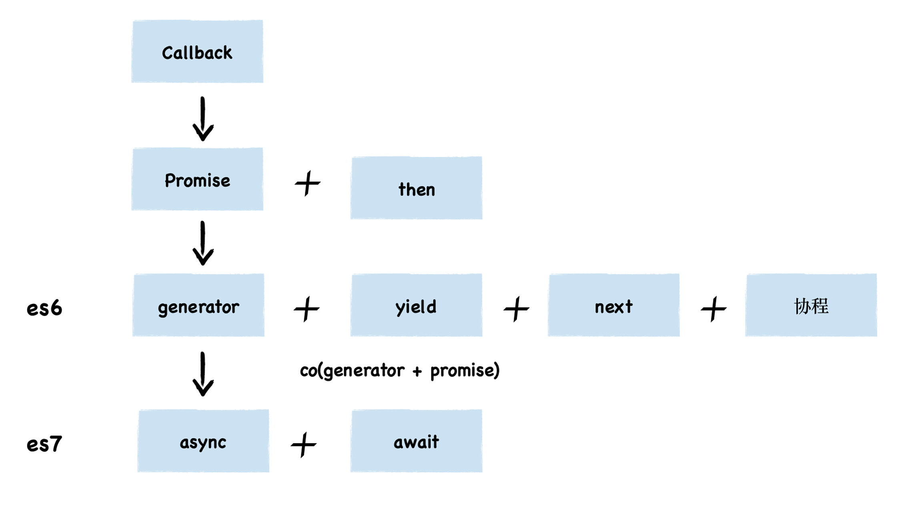

> 【若川】浅析 koa 洋葱模型和 co 原理：https://juejin.cn/post/6844904088220467213
>
> 【明海Zzzz】co 源码解析：https://juejin.cn/post/6844903472362422286
>
> 【骁】 co 库源码：https://www.yuque.com/ruochuan12/dxsvhs/pgzu2c

## 1. 前言

这周看的是 co 的源码，我对 co 比较陌生，没有了解和使用过。因此在看源码之前，我希望能大概了解 co 是什么，解决了什么问题。

## 2. 简单了解 co

先看了 co 的 [GitHub](https://github.com/tj/co)，README 是这样介绍的：

> Generator based control flow goodness for nodejs and the browser, using promises, letting you write non-blocking code in a nice-ish way.

看起来有点懵逼，又查了一些资料，大多说 co 是用于 generator 函数的自动执行。generator 是 ES6 提供的一种异步编程解决方案，它最大的特点是可以控制函数的执行。

### 2.1 关于 generator

说到异步编程，我们很容易想到还有 promise，async 和 await。它们有什么区别呢？先看看 JS 异步编程进化史：callback -> promise -> generator -> async + await



再看看它们语法上的差异：

| Callback            | Promise                                           | Generator                  | async + await + Promise                |
| ------------------- | ------------------------------------------------- | -------------------------- | -------------------------------------- |
| ajax(url, () => {}) | Promise((resolve,reject) => { resolve() }).then() | function* gen() { yield 1} | async getData() {  await fetchData() } |

> 关于 generator 的学习不在此篇幅详写了，需要了解它的概念和语法。

## 3. 学习目标

经过简单学习，大概明白了 co 产生的背景，因为 generator 函数不会自动执行，需要手动调用它的 next() 函数，co 的作用就是自动执行 generator 的 next() 函数，直到 done 的状态变成 true 为止。


那么我这一期的学习目标：

1）解读 co 源码，理解它是如何实现自动执行 generator

2）动手实现一个简略版的 co

## 4. 解读 co 源码

co 源码地址：https://github.com/tj/co

### 4.1 整体架构

从 README 中，可以看到是如何使用 co ：

```javascript
co(function* () {
  var result = yield Promise.resolve(true);
  return result;
}).then(function (value) {
  console.log(value);
}, function (err) {
  console.error(err.stack);
});
```

从代码可以看到它接收了一个 generator 函数，返回了一个 Promise，这部分对应的源码如下。

```javascript
function co(gen) {
  var ctx = this;
  // 获取参数
  var args = slice.call(arguments, 1);
  // 返回一个 Promise
  return new Promise(function(resolve, reject) {
    // 把 ctx 和参数传递给 gen 函数
    if (typeof gen === 'function') gen = gen.apply(ctx, args);
    // 判断 gen.next 是否函数，如果不是直接 resolve(gen)
    if (!gen || typeof gen.next !== 'function') return resolve(gen);
    // 先执行一次 next
    onFulfilled();
    // 实际上就是执行 gen.next 函数，获取 gen 的值
    function onFulfilled(res) {
      var ret;
      try {
        ret = gen.next(res);
      } catch (e) {
        return reject(e);
      }
      next(ret);
      return null;
    }
    // 对 gen.throw 的处理
    function onRejected(err) {
      var ret;
      try {
        ret = gen.throw(err);
      } catch (e) {
        return reject(e);
      }
      next(ret);
    }
    // 实际处理的函数，会递归执行，直到 ret.done 状态为 true
    function next(ret) {
      // 如果生成器的状态 done 为 true，就 resolve(ret.value)，返回结果
      if (ret.done) return resolve(ret.value);
      // 否则，将 gen 的结果 value 封装成 Promise
      var value = toPromise.call(ctx, ret.value);
      // 判断 value 是否 Promise，如果是就返回 then
      if (value && isPromise(value)) return value.then(onFulfilled, onRejected);
      // 如果不是 Promise，Rejected
      return onRejected(new TypeError('You may only yield a function, promise, generator, array, or object, '
        + 'but the following object was passed: "' + String(ret.value) + '"'));
    }
  });
}
```

看到这里，我产生了一个疑问：Promise + then 也可以处理异步编程，为什么 co 的源码里要把 Promise + generator 结合起来呢，为什么要这样做？直到我搞懂了 co 的核心目的，它使 generator 和 yield 的语法更趋向于同步编程的写法，引用[阮一峰的网络日志](https://www.ruanyifeng.com/blog/2015/04/generator.html)中的一句话就是：

> 异步编程的语法目标，就是怎样让它更像同步编程。

可以看一个 Promise + then 的例子：

```javascript
function getData() {
  return new Promise(function(resolve, reject) {
    resolve(1111)
  })
}
getData().then(function(res) {
  // 处理第一个异步的结果
  console.log(res);
  // 返回第二个异步
  return Promise.resolve(2222)
})
.then(function(res) {
  // 处理第二个异步的结果
  console.log(res)
})
.catch(function(err) {
  console.error(err);
})
```

如果有多个异步处理就会需要写多少个 then 来处理异步之间可能存在的同步关系，从以上的代码可以看到 then 的处理是一层一层的嵌套。如果换成 co，在写法上更优雅也**更符合日常同步编程**的写法：

```javascript
co(function* () {
  try {
    var result1 = yield Promise.resolve(1111)
    // 处理第一个异步的结果
    console.log(result1);
    // 返回第二个异步
    var result2 = yield Promise.resolve(2222)
    // 处理第二个异步的结果
    console.log(result2)
  } catch (err) {
    console.error(err)
  }
});
```

### 4.2 分析 next 函数

源码的 next 函数接收一个 gen.next() 返回的对象 ret 作为参数，形如`{value: T, done: boolean}`，next 函数只有四行代码。

第一行：`if (ret.done) return resolve(ret.value);` 如果 ret.done 为 true，表明 gen 函数到了结束状态，就 resolve(ret.value)，返回结果。

第二行：`var value = toPromise.call(ctx, ret.value);` 调用 toPromise.call(ctx, ret.value) 函数，toPromise 函数的作用是把 ret.value 转化成 Promise 类型，也就是用 Promise 包裹一层再 return 出去。

```javascript
function toPromise(obj) {
  // 如果 obj 不存在，直接返回 obj
  if (!obj) return obj;
  // 如果 obj 是 Promise 类型，直接返回 obj
  if (isPromise(obj)) return obj;
  // 如果 obj 是生成器函数或遍历器对象, 就递归调用 co 函数
  if (isGeneratorFunction(obj) || isGenerator(obj)) return co.call(this, obj);
  // 如果 obj 是普通的函数类型，转换成 Promise 类型函数再返回
  if ('function' == typeof obj) return thunkToPromise.call(this, obj);
  // 如果 obj 是一个数组, 转换成 Promise 数组再返回
  if (Array.isArray(obj)) return arrayToPromise.call(this, obj);
  // 如果 obj 是一个对象, 转换成 Promise 对象再返回
  if (isObject(obj)) return objectToPromise.call(this, obj);
  // 其他情况直接返回
  return obj;
}
```

第三行：`if (value && isPromise(value)) return value.then(onFulfilled, onRejected);` 如果 value 是 Promise 类型，调用 onFulfilled 或 onRejected，实际上是递归调用了 next 函数本身，直到 done 状态为 true 或 throw error。

第四行：`return onRejected(...)` 如果不是 Promise，直接 Rejected。

## 5. 实践

虽然解读了 co 的核心代码，看起来像是懂了，实际上很容易遗忘。为了加深理解，结合上面的 co 源码和自己的思路动手实现一个简略版的 co。

### 5.1 模拟请求

```javascript
function request() {
  return new Promise((resolve) => {
    setTimeout(() => {
      resolve({data: 'request'});
    }, 1000);
  });
}
// 用 yield 获取 request 的值
function* getData() {
  yield request()
}
var g = getData()
var {value, done} = g.next()
// 间隔1s后打印 {data: "request"}
value.then(res => console.log(res))
```

### 5.2 模拟实现简版 co

核心实现：

1）函数传参

2）generator.next 自动执行

```javascript
function co(gen) {
  // 1. 传参
  var ctx = this;
  const args = Array.prototype.slice.call(arguments, 1);
  gen = gen.apply(ctx, args);
  return new Promise(function(resolve, reject) {
    // 2. 自动执行 next
    onFulfilled()
    
    function onFulfilled (res) {
      var ret = gen.next(res);
      next(ret);
    }
    
    function next(ret){
      if (ret.done) return resolve(ret.value);
      // 此处只处理 ret.value 是 Promise 对象的情况，其他类型简略版没处理
      var promise = ret.value;
      // 自动执行
      promise && promise.then(onFulfilled);
    }
  })
}

// 执行
co(function* getData() {
  var result = yield request();
  // 1s后打印 {data: "request"}
  console.log(result)
})
```

## 6. 感想

对我来说，学习一个新的东西（generator）花费的时间远远大于单纯阅读源码的时间，因为需要了解它产生的背景，语法，解决的问题以及一些应用场景，这样在阅读源码的时候才知道它为什么要这样写。

读完源码，我们会发现，其实 co 就是一个自动执行 next() 的函数，而且到最后我们会发现 co 的写法和我们日常使用的 async/await 的写法非常相像，因此也不难理解【async/await 实际上是对 generator 封装的一个语法糖】这句话了。

```javascript
// co 写法
co(function* getData() {
  var result = yield request();
  // 1s后打印 {data: "request"}
  console.log(result)
})
// async await 写法
(async function getData() {
  var result = await request();
  // 1s后打印 {data: "request"}
  console.log(result)
})()
```

不得不说，阅读源码的确是一个开阔视野的好方法，如果不是这次活动，我可能还要晚个大半年才接触到 generator，接触协程的概念，了解到 async/await 实现的原理，希望能够继续坚持下去~


<Comment/>