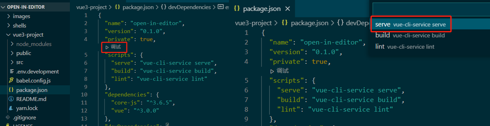
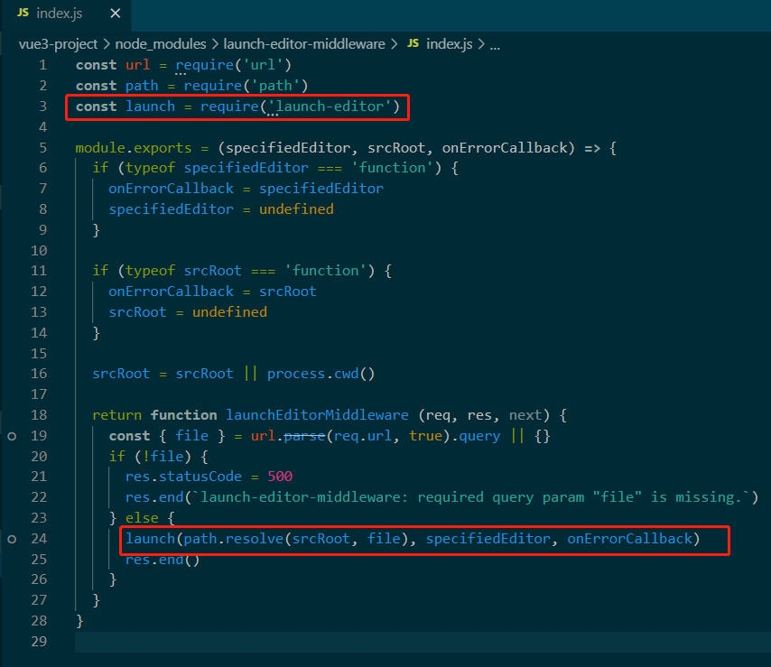
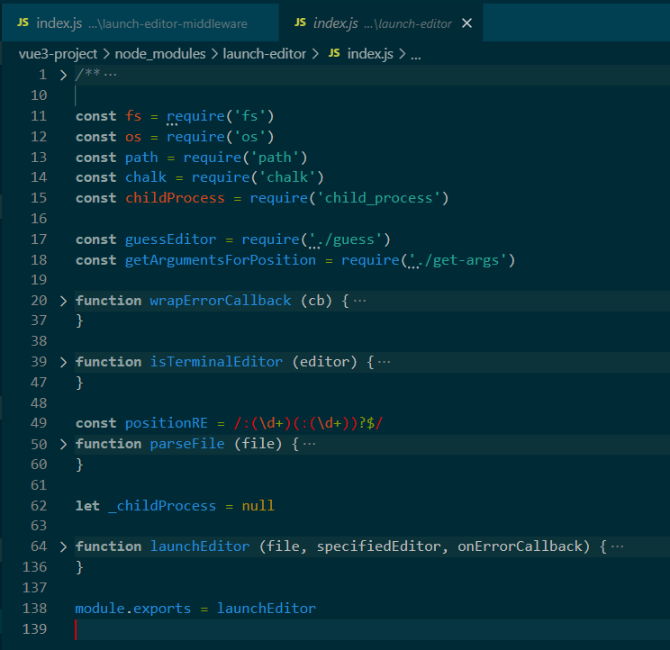
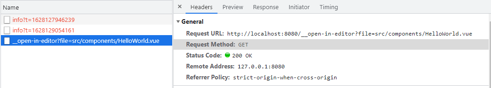

> 【若川】launch-editor 源码解读：https://juejin.cn/post/6959348263547830280

## 1. 解读前的准备

1.1 粗略阅读一遍川哥的源码解读文章，弄清楚文章的主旨内容：探究 vue-devtools「在编辑器中打开组件」功能实现原理**，它的核心实现就是 launch-editor**。


1.2 明确自己到底要学习什么：

​	1）学习调试源码的方法；

​	2）在调试过程中探究 launch-editor 源码是如何实现在编辑器打开对应的文件；

​	目标：跟着川哥的文章完整走完一遍调试的流程，并对外输出记录文档。


1.3 资源：

- 下载川哥的源码：`git clone https://github.com/lxchuan12/open-in-editor.git`，进入 vue3-project 目录，安装依赖`yarn install`
- 安装 vue-devtools 谷歌扩展：翻墙去应用商店下载安装即可（下载 6.0.0 beta 版）

- 了解 [launch-editor](https://github.com/yyx990803/launch-editor)：主要功能是在编辑器中打开带有行号的文件


## 2. 开始学习，浅尝辄止

上述的准备工作搞完之后，我们动手操作一下。


### 2.1 开始动手

我使用的编辑器是 VSCode。

打开 vue3-project 目录的 package.json，点击调试，选择 serve。这一步操作，使得我们以 debug 的形式，运行了 **vue-cli-service serve** 这个命令。




跟着文章实现到这里的时候，我有点懵逼，因为我不知道接下来为什么突然要搜索【launch-editor-middleware】这个库。


直到我再次通读一遍文章，发现川哥前面有提到 vue-devtools 的 [Open component in editor](https://github.com/vuejs/devtools/blob/legacy/docs/open-in-editor.md) 这个文档，这个文档里面描述了引用了【launch-editor-middleware】这个库来实现打开文档的功能。而我之前先入为主地以为，这期是解读 vue-devtools 的源码，其实这只是解读实现打开文档功能的源码而已。


理解了这一层，我们可以直接搜项目里（包括 node_modules）里的【launch-editor-middleware】关键字，就可以找到这个库的源码位置了。


### 2.2 调试之旅

**调试的流程就是打断点，点击调试的流程面板，经过不断调试，观察数据的变化。**


下图【launch-editor-middleware】的源码，在这份源码中我们能很轻易地分析出，最终运行的是 launch 函数，我们可以这这里打一个断点，然后进入到【launch-editor】的源码，实际运行的是 **launchEditor** 函数。





粗略看一遍 launchEditor 函数，发现它实际上是做了四件事：

- 获取 fileName，lineNumber，columnNumber
- 异常处理：是否存在文件，onErrorCallback，是否存在 editor

- 猜测当前正在使用的编辑器：guessEditor
- 使用 child_process.spwan 异步打开一个子进程模块，它调起了 cmd.exe 工具打开我们的编辑器，并打开了文件（args 就是文件的参数）


看完了这个函数，其实大概实现的原理也就出来了，核心代码如下：

```javascript
if (process.platform === 'win32') {
  _childProcess = childProcess.spawn(
    'cmd.exe',
    ['/C', editor].concat(args),
    { stdio: 'inherit' }
  )
} else {
  _childProcess = childProcess.spawn(editor, args, { stdio: 'inherit' })
}
```


但我们肯定还有很多疑惑，比如：

- 在浏览器控制台点击按钮，编辑器是怎么接收到它的请求信息呢？
- 用到了哪些 API/编程技巧？

- 这个功能实现如果让我们来实现，是怎么实现呢（复述思路）？


## 3. 动手操作，深入实践

在前面的拆解中，虽然很多地方看似看懂了，但又没完全懂，那我们来解答一下在看源码的时候的疑问：

### 3.1 编辑器如何接收到浏览器的请求信息

点击 vue-devtools 的按钮时，我们会发现它发送了一个请求：http://localhost:8080/__open-in-editor?file=src/components/HelloWorld.vue




那编辑器是如何接收到这个请求呢？搜索【launch-editor-middleware】关键字，我们会发现，在 @vue/cli-service 的 serve.js 文件中，使用了 **app.use("/__open-in-editor")**，用过 express 的小伙伴会比较熟悉，这是express 引入中间件的用法。当浏览器发送 http://localhost:8080/__open-in-editor?file=src/components/HelloWorld.vue 这个请求的时候，就进入到下面这个代码了。

```javascript
// vue3-project/node_modules/@vue/cli-service/lib/commands/serve.js
// 46行
const launchEditorMiddleware = require('launch-editor-middleware')
// 192行
before (app, server) {
    // launch editor support.
    // this works with vue-devtools & @vue/cli-overlay
    app.use('/__open-in-editor', launchEditorMiddleware(() => console.log(
        `To specify an editor, specify the EDITOR env variable or ` +
        `add "editor" field to your Vue project config.\n`
    )))
    // 省略若干代码...
}
```


### 3.2 用到了哪些 API/编程技巧

#### 3.2.1 函数的重载

在【launch-editor-middleware】的入口函数这里，使用了函数重载的写法，这种写法在很多源码中都很常见，目的是方便用户调用时传参，针对不定量的参数对应不同的操作内容。

```javascript
// vue3-project/node_modules/launch-editor-middleware/index.js
const url = require('url')
const path = require('path')
const launch = require('launch-editor')

module.exports = (specifiedEditor, srcRoot, onErrorCallback) => {
  // specifiedEditor => 这里传递过来的则是 () => console.log() 函数
  // 所以和 onErrorCallback 切换下，把它赋值给错误回调函数
  if (typeof specifiedEditor === 'function') {
    onErrorCallback = specifiedEditor
    specifiedEditor = undefined
  }

  // 如果第二个参数是函数，同样把它赋值给错误回调函数
  // 这里传递过来的是undefined
  if (typeof srcRoot === 'function') {
    onErrorCallback = srcRoot
    srcRoot = undefined
  }

  // srcRoot 是传递过来的参数，或者当前 node 进程的目录
  srcRoot = srcRoot || process.cwd()

  // 最后返回一个函数， express 中间件
  return function launchEditorMiddleware (req, res, next) {
    // 省略 ...
  }
}
```


#### 3.2.2 装饰器模式

这段代码 wrapErrorCallback 先执行其他代码，再去执行 onErrorCallback，这种包裹函数的形式在很多源码里都也很常见，可以理解为一个装饰器，把 onErrorCallback 包装了起来，对原函数进行了增强。

这也是设计模式中的装饰器设计模式：

```javascript
function wrapErrorCallback (cb) {
  return (fileName, errorMessage) => {
    console.log()
    console.log(
      chalk.red('Could not open ' + path.basename(fileName) + ' in the editor.')
    )
    if (errorMessage) {
      if (errorMessage[errorMessage.length - 1] !== '.') {
        errorMessage += '.'
      }
      console.log(
        chalk.red('The editor process exited with an error: ' + errorMessage)
      )
    }
    console.log()
    if (cb) cb(fileName, errorMessage)
  }
}

onErrorCallback = wrapErrorCallback(onErrorCallback)
```

#### 3.2.3 apply

apply 语法：*func.apply(thisArg, [argsArray])*，也经常在源码中可以看到。这里使用 apply 是把 extraArgs 作为 push 方法的 arguments 传进去。

```javascript
if (lineNumber) {
  // getArgumentsForPosition 返回一个数组
  const extraArgs = getArgumentsForPosition(editor, fileName, lineNumber, columnNumber)
  // 将 extraArgs 参数 push 到 args 里
  args.push.apply(args, extraArgs)
} else {
  args.push(fileName)
}
```

#### 3.2.4 cild_process

child_process 是 Node.js 的一个模块，它提供了衍生子进程的能力，默认情况下，会在父 Node.js 进程和衍生的子进程之间建立 stdin、stdout 和 stderr 的管道。

#### 3.2.5 process.platform

用于标识运行 Node.js 进程的操作系统平台，返回字符串，目前可能的值有：  "aix" | "darwin" | "freebsd" | "linux" | "openbsd" | "sunos" | "win32"

### 3.3 如何实现（复述思路）

- 浏览器与编辑器的通讯：借助 Node.js 进程，与浏览器发生通讯
- 浏览器将需要打开的文件路径通过参数传递给编辑器

- 判断操作系统平台和所使用的编辑器（每个平台的命令行程序不一样，每个编辑器的环境变量也不一样）
- 借助 Node 调起 cmd.exe 工具打开我们的编辑器，打开对应路径的文件

```javascript
// 伪代码
app.use("__open-in-editor", handleLaunchEditor)

function handleLaunchEditor(filePath) {
  const platform = process.platform
  const editor = guessEditor()
  childProcess.spawn(editor, fileArgs, { stdio: 'inherit' })
}
```

## 4. 感想

-  编码能力：通过解读 launch-editor 源码，学习/重温了【函数的重载】【装饰器模式】【apply 使用方法】，源码的组织结构也非常值得我们学习，比如里面很多功能代码都单独封装起来，封装成函数或者模块，使得整个源码的结构非常清晰，核心通俗易懂，易于解读和维护。（这也可以理解为自顶向下的编程方法） 
-  拓展视野：源码中包含了很多与 Node.js 相关的方法，有很多都是我不熟悉的，在解读源码的过程也是我学习 Node.js 的过程。 

-  工作中可能会用到： 

- - 开发 VSCode 插件与外界通讯可借助 Node.js 进程
  - 装饰器模式的应用

- - 判断操作系统平台


<Comment/>