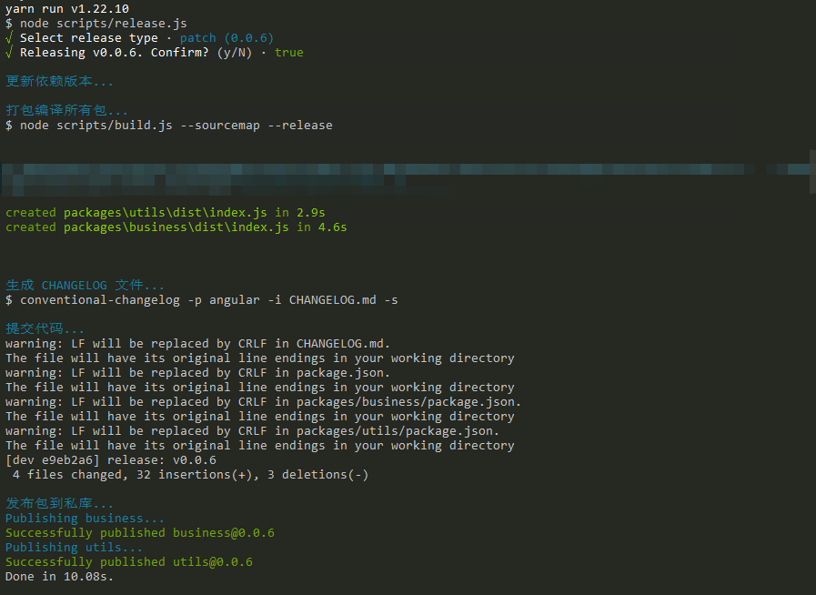

> 【若川】Vue3 Release 源码解读：https://juejin.cn/post/6997943192851054606

## 1. 学习目标和资源准备

这一期阅读的是 Vue3 源码中的 script/release.js 代码，也就是 Vue.js 的发布流程。在上一期源码阅读中从 [.github/contributing.md](https://github.com/vuejs/vue-next/blob/master/.github/contributing.md) 了解到 Vue.js 采用的是 monorepo 的方式进行代码的管理。

monorepo 是管理项目代码的一个方式，指在一个项目仓库 (repo) 中管理多个模块/包 (package)，不同于常见的每个 package 都建一个 repo。

刚好我最近搭建组件库也是使用 monorepo 的方式去管理包。 monorepo 有个缺点，因为每个包都维护着自己的 dependencies，那么在 install 的时候会导致 node_modules 的体积非常大。目前最常见的 monorepo 解决方案是使用 lerna 和 yarn 的 workspaces 特性去处理仓库的依赖，我搭建的组件库也是使用了 lerna 和 yarn。但 Vue3 的包管理没有使用 lerna，它是怎么管理依赖包的版本号呢？让我们跟着源码一探究竟。

> [Lerna](https://www.lernajs.cn/) 是一个管理工具，用于管理包含多个软件包（package）的 JavaScript 项目，针对使用 git 和 npm 管理多软件包代码仓库的工作流程进行优化。

**学习目标：**

1）学习 release.js 源码，输出记录文档。

**资源准备：**

Vue3 源码地址：`https://github.com/vuejs/vue-next`

## 2. Yarn Workspace

```typescript
// vue-next/package.json （多余的代码已省略）
{
    "private": true,
    "version": "3.2.2",
    "workspaces": [
        "packages/*"
    ],
    "scripts": {
        "release": "node scripts/release.js"
    }
}
```

Yarn 从 1.0 版开始支持 Workspace （工作区），Workspace 可以更好的统一管理有多个项目的仓库。

- 管理依赖关系便捷：每个项目使用独立的 package.json 管理依赖，可以使用 yarn 命令一次性安装或者升级所有依赖，无需在每个目录下分别安装依赖
- 降低磁盘空间占用：可以使多个项目共享同一个 node_modules 目录

## 3. release.js 文件解读

先手动跑一遍 `yarn run release --dry`，控制台会输出以下信息（多余信息已省略），从控制台日志看出来，发布 Vue.js 会经历以下几个步骤：

```
// 确认发布版本号
? Select release type ... 
> patch (3.2.3)
  minor (3.3.0)
  major (4.0.0)
  custom
// 执行测试用例
Running tests...
// 更新依赖版本
Updating cross dependencies...
// 打包编译所有包
Building all packages...
// 生成 changelog
conventional-changelog -p angular -i CHANGELOG.md -s
// 提交代码
Committing changes...
// 发布包
Publishing packages...
// 推送代码到 GitHub
Pushing to GitHub...
```

初步了解发布流程后，来看看 release.js 源码做了什么，先看入口函数 main()

### main 函数

代码太多就不贴代码了，记录一下思路和思考

1. 确认要发布的版本：

- - 如果从命令行获取到了版本号，先验证版本号规范，再次确认版本号
  - 如果命令行没有输入版本号，会让用户选择一个版本发布

确认版本号使用了一个库叫 **semver**，它的作用是用于版本校验比较。

```js
// 目的是获取命令行参数（也就是允许用户自定义输入版本号，比如 yarn release v3.5.0）
const args = require('minimist')(process.argv.slice(2))
let targetVersion = args._[0]
```

2. 执行测试用例

```js
const execa = require('execa')
const run = (bin, args, opts = {}) => execa(bin, args, { stdio: 'inherit', ...opts })
const bin = name => path.resolve(__dirname, '../node_modules/.bin/' + name)

if (!skipTests && !isDryRun) {
  // bin("jest") 先获取 node_modules/.bin/jest 的目录，run 的本质就是执行命令行
  // 这行代码的意思就相当于在命令终端，项目根目录运行 ./node_modules/.bin/jest 命令。
  await run(bin('jest'), ['--clearCache'])
  await run('yarn', ['test', '--bail'])
} else {
  console.log(`(skipped)`)
}
```

3. 更新依赖版本

```js
// 1）获取 packages 目录下的所有包
const packages = fs
  .readdirSync(path.resolve(__dirname, '../packages'))
  .filter(p => !p.endsWith('.ts') && !p.startsWith('.'))
// 1）获取包的根目录路径
const getPkgRoot = pkg => path.resolve(__dirname, '../packages/' + pkg)
// 2）更新根目录和 packages 目录下每个包的 package.json 的版本号
function updateVersions(version) {}
// 3）实现更新 package.json 版本号的，以及更新依赖包的版本号
function updatePackage(pkgRoot, version) {}
// 4）实现更新与 vue 相关依赖包的版本号
function updateDeps(pkg, depType, version) {}
```

4. 打包编译所有包

这部分涉及另外一个文件 script/build.js，这个文件主要是将各个包打包在对应的目录下，比如打包一个依赖就运行一次`yarn build`，如果有多个包，就异步循环调用打包命令。核心代码如下：

```javascript
/**
 * 迭代打包
 * @param {*} maxConcurrency 最大并发
 * @param {*} source 目录
 * @param {*} iteratorFn 构建函数（核心就是运行 build 命令）
 * @returns
 */
async function runParallel(maxConcurrency, source, iteratorFn) {
  const ret = [];
  const executing = [];
  for (const item of source) {
    const p = Promise.resolve().then(() => iteratorFn(item, source));
    ret.push(p);

    if (maxConcurrency <= source.length) {
      const e = p.then(() => executing.splice(executing.indexOf(e), 1));
      executing.push(e);
      if (executing.length >= maxConcurrency) {
        await Promise.race(executing);
      }
    }
  }
  return Promise.all(ret);
}
```

5. 生成 CHANGELOG 文件

主要运行的是这行命令：conventional-changelog -p angular -i CHANGELOG.md -s

6. 提交代码

先执行 git diff 命令，检查文件是否有修改，如果有，执行 git add 和 git commit 命令

7. 发布包

最后执行的命令是，yarn publish，发布新版本和打 Tag

8. 推送到 GitHub

主要运行的命令：

- - 打 tag：git tag ${version}
  - 推送 tag：git push origin refs/tags/${version}

- - 提交代码到远程仓库：git push

至此，release 发布流程已经分析完了。


## 4. 感想

回答一下开篇的问题，Vue 是如何管理版本号呢？阅读完源码我们会分现，在发版的时候会**统一更新所有包的 package.json 的版本号**。对比我在搭建组件库过程中使用的 lerna，其实 lerna 是把 release 这一套流程封装成了一个包，它里面处理发包的流程跟 Vue Release 流程基本是一致的。


这次的源码解读解答了我的一些疑惑。在我搭建组件库的过程中，我一开始了解到的是一个组件一个目录，单包推送到 npm 私库。这样做的缺点很明显，需要在每个目录安装一遍依赖，单独处理版本号。后来了解到了 yarn workspace，知道它可以处理依赖安装的问题，但版本号的处理还是没有解决方案。于是我去寻找业内比较流行的解决办法，发现大部分是使用了 lerna。


于是我向我的 TL 沟通询问，可否采用 yarn + lerna 的方式来搭建组件库。我记得特别清楚他反问我，问我 lerna 解决了什么问题，我支支吾吾回答了官网上的介绍，因为我当时对 lerna 的了解仅停留在官网以及它的常用命令，实际上我不知道它解决了什么问题。TL 见我答不上来，回复了我一句【如无必要，勿增实体】。


通过这次的源码阅读，我可以回答 TL 反问我的那个问题了，lerna 解决的是发包流程中版本号处理，自动生成 CHANGELOG 文件，提交代码，发布包，推送到仓库这几个问题，它把这几个流程封装成命令供用户使用。它不是搭建组件库非必要引入的工具，虽然引用了 lerna 会增加了新的复杂度，但在不了解发包流程的前期使用 lerna 可以使组件库开发者更专注于组件开发的工作上，而不需要过度关注如何发包。

## 5. 实践

经过一番思考，我认为引入 lerna 确实给系统增加了一些复杂度，因为它要求开发人员额外学习 lerna 的一些知识和命令，增加了学习成本以及系统复杂度。我觉得可以参考 Vue 的 release.js，写一个适用于项目的构建发版脚本用来发包，降低系统复杂度。


逻辑代码基本与 Vue3 的 release.js 和 build.js 一致，去掉了一些没必要的代码，比如单元测试和一些环境判断。还修改了一下 rollup.config.js 的配置，感觉用起来确实比 lerna 好用一些。最终效果如下：




<Comment/>