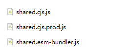

> 【若川】Vue3 源码基础工具函数解读链接：https://juejin.cn/post/6994976281053888519

## 1. 解读前的准备

粗略阅读了川哥的文章之后，感觉这期跟上一期不一样。上一期主要学习如何实现某个功能，而这一期主要是学习 **Vue3 源码中的工具函数**，以及 **Vue3 源码的一些调试技巧**。虽然看起来偏基础，但我觉得很考验一个程序员的基本功和耐心。


学习目标：

1）调试源码之打包构建项目代码，生成 sourcemap 调试源码

2）学习源码中的工具函数

目标：跟着川哥的文章走完一遍调试的流程，动手敲工具函数，对外输出记录文档。


资源准备：

Vue3 源码地址：`https://github.com/vuejs/vue-next`


## 2. 源码调试

### 2.1 阅读开源项目的 README.md 和贡献指南 contributing.md

我觉得这两个文件对阅读源码的开发者来说十分重要。README.md 描述的是项目的基本信息，它可以快速了解这个项目的全貌。贡献指南 contributing.md 会包含如何参与项目开发，项目打包/运行命令，项目目录结构等等，它能帮助你更好地调试/参与开发源码。在 contributing.md 中我看到了一些比较感兴趣的知识点，比如打包构建格式/配置，包依赖处理。

### 2.2 打包构建项目代码

安装完依赖，直接运行`yarn build`就可以打包 Vue3 的项目代码了，打包的产物如下（以 shared 模块为例）：



这里的 `cjs`，`esm` 是 JS 里用来实现【模块化】的不同规则，JS 的模块化标准还有 `amd`，`umd`，`iife`。

- CJS，CommonJS，只能在 NodeJS 上运行，使用 require("module") 读取并加载模块，不支持浏览器
- ESM，ECMAScript Module，现在使用的模块方案，使用 import export 来管理依赖，浏览器直接通过 `<script type="module">` 即可使用该写法。NodeJS 可以通过使用 mjs 后缀或者在 package.json 添加 "type": "module" 来使用

### 2.3 生成 sourcemap 调试 vue-next 源码

在贡献指南 contributing.md 文件中描述了如何生成 sourcemap 文件：添加【--sourcemap】参数即可。

```
node scripts/dev.js --sourcemap
```

packages/vue/dist/vue.global.js.map 就是 sourcemap 文件了。

sourcemap 是一个信息文件，里面储存着位置信息，转换后的代码的每一个位置，所对应的转换前的位置。有了它，出错时出错工具将直接显示原始代码，而不是转换后的代码，方便调试。


## 3. 工具函数（TS 版）

### 3.1 babelParserDefaultPlugins：babel 解析默认插件

```typescript
/**
 * List of @babel/parser plugins that are used for template expression
 * transforms and SFC script transforms. By default we enable proposals slated
 * for ES2020. This will need to be updated as the spec moves forward.
 * Full list at https://babeljs.io/docs/en/next/babel-parser#plugins
 */
const babelParserDefaultPlugins = [
  'bigInt',
  'optionalChaining',
  'nullishCoalescingOperator'
] as const
```

它定义了三个默认插件， `as const` 这个语法叫 [const 断言](https://www.typescriptlang.org/docs/handbook/release-notes/typescript-3-4.html#const-assertions)，它可以创建完整的 readonly 对象（只读状态），编译器可以通过 as const 推断出可用于的最具体的表达类型。


### 3.2 EMPTY_OBJ：空对象，EMPTY_ARR：空数组

```typescript
export const EMPTY_OBJ: { readonly [key: string]: any } = __DEV__
  ? Object.freeze({})
  : {}

export const EMPTY_ARR = __DEV__ ? Object.freeze([]) : []
```

Object.freeze 冻结对象，不可修改对象的最外层，这样的写法可以降低在开发过程中发生错误。

__DEV__  是一个环境变量，为了避免在生产环境报错，生产环境使用的还是 {} 和 []。


### 3.3 NOOP：空函数

```typescript
export const NOOP = () => {}
```


### 3.4 NO：永远返回 false 的函数

```typescript
export const NO = () => false
```


### 3.5 isOn：判断字符串是否以 on 开头，并且 on 后首字母是非小写字母

```typescript
const onRE = /^on[^a-z]/
export const isOn = (key: string) => onRE.test(key)
```

【^】符号在开头，表示是指【以什么开头】，在其他地方是指【非】。与之相反的是：【$】符合在结尾，则表示是以什么结尾。

日常开发中我们也经常会用到正则判断，可以收集起来，积累的数量多了就不用每次都去搜索了😉。


### 3.6 isModelListener：监听器

```typescript
export const isModelListener = (key: string) => key.startsWith('onUpdate:')
```

判断字符串是不是以【onUpdate:】开头


### 3.7 extend：合并对象

```typescript
export const extend = Object.assign
```

其实 extend 就是 [Object.assign](https://developer.mozilla.org/zh-CN/docs/Web/JavaScript/Reference/Global_Objects/Object/assign)，用于将所有可枚举属性的值从一个或多个源对象分配到目标对象。


### 3.8  remove：移除数组的一项

```typescript
export const remove = <T>(arr: T[], el: T) => {
  const i = arr.indexOf(el)
  if (i > -1) {
    arr.splice(i, 1)
  }
}
```

看源码的实现很好理解，传入一个数组和一个元素，判断元素是否存在在数组中，如果存在将其删除。

川哥的文章里有说到，splice 是一个很耗性能的方法，删除数组中的一项，其他元素都要移动位置。**所以在考虑性能的情况下，可以将删除的元素设为 null，在使用执行时为 null 的不执行，也可达到相同的效果**。


### 3.9 hasOwn：判断一个属性是否属于某个对象

```typescript
const hasOwnProperty = Object.prototype.hasOwnProperty
export const hasOwn = (
  val: object,
  key: string | symbol
): key is keyof typeof val => hasOwnProperty.call(val, key)
```

函数本身很好理解，利用原型的 API：hasOwnProperty 来判断 key 是否是 obj 本身的属性。

但【key is keyof typeof val】可能会有些迷惑，这里包含了三个 typescript 的语法，意思是函数返回的 key 是 属于 val 对象的键的联合类型。

- 【is】关键字：它被称为类型谓词，用来判断一个变量属于某个接口或类型，比如：

```typescript
const isNumber = (val: unknown): val is number => typeof val === 'number'
const isString = (val: unknown): val is string => typeof val === 'string'
```

- 【keyof】关键字：用于获取某种类型的所有键，其返回类型是联合类型，比如：

```typescript
interface Person {
    name: string;
    age: number;
}
type K = keyof Person; // "name" | "age"
```

- 【typeof】关键字：js 中的 typeof 只能获取几种类型，而在 ts 中 typeof 用来获取一个变量声明或对象的类型，比如：

```typescript
interface Person {
  name: string;
  age: number;
}

const sem: Person = { name: 'semlinker', age: 30 };
type Sem = typeof sem; // -> Person
```


### 3.10 判断是否某种类型

```typescript
// 判断数组
export const isArray = Array.isArray

// 对象转字符串
export const objectToString = Object.prototype.toString
export const toTypeString = (value: unknown): string =>
  objectToString.call(value)

// 判断是否 Map 对象
export const isMap = (val: unknown): val is Map<any, any> =>
  toTypeString(val) === '[object Map]'

// 判断是否 Set 对象
export const isSet = (val: unknown): val is Set<any> =>
  toTypeString(val) === '[object Set]'

// 判断是否 Date 对象
export const isDate = (val: unknown): val is Date => val instanceof Date

// 判断是否函数
export const isFunction = (val: unknown): val is Function =>
  typeof val === 'function'

// 判断是否字符串
export const isString = (val: unknown): val is string => typeof val === 'string'

// 判断是否 Symbol
export const isSymbol = (val: unknown): val is symbol => typeof val === 'symbol'

// 判断是否对象（不包括 null）
export const isObject = (val: unknown): val is Record<any, any> =>
  val !== null && typeof val === 'object'

// 判断是否 Promise
export const isPromise = <T = any>(val: unknown): val is Promise<T> => {
  return isObject(val) && isFunction(val.then) && isFunction(val.catch)
}
```

有了这些函数就可以在工作中用起来啦。


### 3.11 toRawType：对象转字符串，截取后第八位到倒数第二位。

```typescript
export const toRawType = (value: unknown): string => {
  // extract "RawType" from strings like "[object RawType]"
  return toTypeString(value).slice(8, -1)
}
```

可以截取到 String Array 等这些类型，这个函数可以用来做类型判断。


### 3.12  isPlainObject：判断是否纯粹的对象

```typescript
export const isPlainObject = (val: unknown): val is object =>
  toTypeString(val) === '[object Object]'
```


### 3.13 isIntegerKey：判断是不是数字型的字符串 key 值

```typescript
export const isIntegerKey = (key: unknown) =>
  isString(key) &&
  key !== 'NaN' &&
  key[0] !== '-' &&
  '' + parseInt(key, 10) === key
```

第一步先判断 key 是否是字符串类型（作为 key 值有两种类型，string 和 symbol），第二步排除 NaN 值，第三步排除 - 值（排除负数），第四步将 key 转换成数字再隐式转换为字符串，与原 key 对比。


### 3.14 isReservedProp：判断该属性是否为保留属性

```typescript
/**
 * Make a map and return a function for checking if a key
 * is in that map.
 * IMPORTANT: all calls of this function must be prefixed with
 * \/\*#\_\_PURE\_\_\*\/
 * So that rollup can tree-shake them if necessary.
 */
export function makeMap(
  str: string,
  expectsLowerCase?: boolean
): (key: string) => boolean {
  const map: Record<string, boolean> = Object.create(null)
  const list: Array<string> = str.split(',')
  for (let i = 0; i < list.length; i++) {
    map[list[i]] = true
  }
  return expectsLowerCase ? val => !!map[val.toLowerCase()] : val => !!map[val]
}

export const isReservedProp = /*#__PURE__*/ makeMap(
  // the leading comma is intentional so empty string "" is also included
  ',key,ref,' +
    'onVnodeBeforeMount,onVnodeMounted,' +
    'onVnodeBeforeUpdate,onVnodeUpdated,' +
    'onVnodeBeforeUnmount,onVnodeUnmounted'
)

// 使用：
isReservedProp("key") // true
isReservedProp("test") // false
isReservedProp("") // true
```

如何解读这个函数？先看 makeMap，它传入一个字符串，将这个字符串转换成数组，并循环赋值 key 給一个空对象map，然后返回一个包含参数 val 的闭包用来检查 val 是否是存在在字符串中。

isReservedProp("key") 其实就相当于 makeMap(str)("key")。


### 3.15 cacheStringFunction 缓存字符串的函数

```typescript
const cacheStringFunction = <T extends (str: string) => string>(fn: T): T => {
  const cache: Record<string, string> = Object.create(null)
  return ((str: string) => {
    const hit = cache[str]
    return hit || (cache[str] = fn(str))
  }) as any
}

// 使用例子：
// "-"连字符转小驼峰
// \w：0-9a-zA-Z_，表示由数字，大小写字母和下划线组成
const camelizeRE = /-(\w)/g
export const camelize = cacheStringFunction((str: string): string => {
  return str.replace(camelizeRE, (_, c) => (c ? c.toUpperCase() : ''))
})
camelize("text-node") // "textNode"

// 大写字母转"-"连字符
// \B 是指 非 \B 单词边界。
const hyphenateRE = /\B([A-Z])/g;
const hyphenate = cacheStringFunction((str) => str.replace(hyphenateRE, '-$1').toLowerCase());
hyphenate("WordPress") // "word-press"

// 首字母转大写
const capitalize = cacheStringFunction(
  (str: string) => str.charAt(0).toUpperCase() + str.slice(1)
)
const toHandlerKey = cacheStringFunction((str) => (str ? `on${capitalize(str)}` : ``));
toHandlerKey('click') // "onClick"
```

这个函数和上面 makeMap 函数类似，传入一个 fn 参数，返回一个包含参数 str 的闭包，将这个 str 字符串作为 key 赋值给一个空对象 cache，闭包返回 cache[str] || (cache[str] = fn(str))。

【cache[str] || (cache[str] = fn(str))】的意思是，如果 cache 有缓存到 str 这个 key，直接返回对应的值，否则，先调用 fn(str)，再赋值给 cache[str]，这样可以将需要经过 fn 函数处理的字符串缓存起来，避免多次重复处理字符串。


### 3.16 hasChanged：判断值是否有变化

```typescript
const hasChanged = (value: any, oldValue: any): boolean =>
  !Object.is(value, oldValue)
```

[Object.is](about:blank) 方法判断两个值是否为同一个值。


### 3.17  invokeArrayFns：执行数组里的函数

```typescript
export const invokeArrayFns = (fns: Function[], arg?: any) => {
  for (let i = 0; i < fns.length; i++) {
    fns[i](arg)
  }
}
```

这种写法方便统一执行多个函数。


### 3.18 def：定义一个不可枚举的对象

```typescript
export const def = (obj: object, key: string | symbol, value: any) => {
  Object.defineProperty(obj, key, {
    configurable: true,
    enumerable: false,
    value
  })
}
```

[Object.defineProperty](about:blank)，语法：*Object.defineProperty(obj, prop, descriptor)*，它是一个非常重要的 API，经常会在源码中看见它。

> 在 ES3 中，除了一些内置属性（如：Math.PI），对象所有的属性在任何时候都可以被[修改、插入、删除。
>
> 在ES5 中，我们可以设置属性是否可以被改变或是被删除——在这之前，它是内置属性的特权。
>
> ES5 中引入了**属性描述符**的概念，我们可以通过它对所定义的属性有更大的控制权，这些**属性描述符**（特性）包括：
> value —— 获取属性时所返回的值。
> writable —— 该属性是否可写。
> enumerable —— 该属性在 for in 循环中是否会被枚举。
> configurable —— 该属性是否可被删除。
> set() —— 该属性的更新操作所调用的函数。
> get() —— 获取属性值时所调用的函数。
>
> 另外，**数据描述符**（其中属性为：enumerable，configurable，value，writable）与**存取描述符**（其中属性为enumerable，configurable，set()，get()）之间是有互斥关系的。在定义了set()和get()之后，描述符会认为存取操作已被定义了，其中再定义 value 和 writable 会**引起错误**。


### 3.19 toNumber：转数字

```typescript
  export const toNumber = (val: any): any => {
    const n = parseFloat(val)
    return isNaN(n) ? val : n
  }
```


### 3.20 getGlobalThis：全局对象

```typescript
let _globalThis: any
export const getGlobalThis = (): any => {
  return (
    _globalThis ||
    (_globalThis =
      typeof globalThis !== 'undefined'
        ? globalThis
        : typeof self !== 'undefined'
        ? self
        : typeof window !== 'undefined'
        ? window
        : typeof global !== 'undefined'
        ? global
        : {})
  )
}
```

第一次调用这个函数时，_globalThis 肯定为 "undefined"，接着执行【||】后的语句。

1. `typeof globalThis !== 'undefined'` 如果 globalThis 不是 undefined，返回 globalThis：[MDN globalThis](https://link.juejin.cn/?target=https%3A%2F%2Fdeveloper.mozilla.org%2Fzh-CN%2Fdocs%2FWeb%2FJavaScript%2FReference%2FGlobal_Objects%2FglobalThis)。否则 ->
2. `typeof self !== 'undefined'` 如果 self 不是 undefined，返回 self。否则 ->
3. `typeof window !== 'undefined'` 如果 window 不是 undefined，返回 widow。否则 ->
4. `typeof global !== 'undefined'` 如果 global 不是 undefined，返回 global。否则 ->
5. 返回 {}

第二次调用这个函数，就直接返回 _globalThis，不需要第二次继续判断了👍

## 4. 感想

- 很多工具函数可以通过做缓存以达到优化性能的目的
- [Object 对象 API 解析](https://mp.weixin.qq.com/s/Y3nL3GPcxiqb3zK6pEuycg) 无论什么时候都不过时，适合反复阅读，加深对 Object 的理解

- 工作中如果有用到类似的工具函数，可参考这些写法
- 学习了一些 typescript 不太常见的语法： 【! 非空断言操作符】【?? 空值合并运算符】

- 生成 sourcemap 调试 ts 代码


<Comment/>